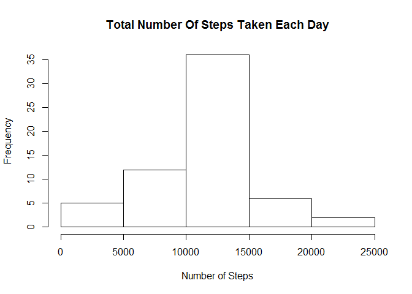

# Reproducible Research: Peer Assessment 1


### Loading and preprocessing the data

1. Load the data (i.e. `read.csv()`)

```r
## it requires 'activity.csv' to be in the working directory
data <- read.csv("activity.csv", header=TRUE)
```
2. Process/transform the data (if necessary) into a format suitable for your analysis

```r
## convert the date variable into Date type
data$date <- as.Date(data$date)
```

### What is mean total number of steps taken per day?
For this part of the assignment, you can ignore the missing values in the dataset.
We interpret that as leaving the missing values untouched instead of removing them.
It could mean the opposite, but in our case it makes little difference and can be done by switching the na.rm parameter of the "aggregate" function.


```r
## Calculate total steps per day
totalst_per_day <- aggregate(cbind(steps) ~ date, data = data, FUN = sum, na.rm = FALSE)
```
1. Make a histogram of the total number of steps taken each day

```r
## Histogram
hist(totalst_per_day$steps, breaks = 7, main = "Total Number Of Steps Taken Each Day", xlab='Steps')
```

 
    
2. Calculate and report the **mean** and **median** total number of steps taken per day

```r
## Mean
mean(totalst_per_day$steps)
```

```
## [1] 10766
```

```r
## Median
median(totalst_per_day$steps)
```

```
## [1] 10765
```

### What is the average daily activity pattern?

1. Make a time series plot (i.e. `type = "l"`) of the 5-minute interval (x-axis) and the average number of steps taken, averaged across all days (y-axis)


```r
avg_by_interval <- aggregate(cbind(steps) ~ interval, data = data, FUN = mean, na.rm = FALSE)
plot(avg_by_interval$interval, avg_by_interval$steps, type="l", ylab='Average Steps', xlab='Interval', main='Average Number Of Steps Taken Per Interval')
```

 
    
2. Which 5-minute interval, on average across all the days in the dataset, contains the maximum number of steps?

```r
avg_by_interval[avg_by_interval$steps == max(avg_by_interval$steps),"interval"]
```

```
## [1] 835
```

### Imputing missing values

1. Calculate and report the total number of missing values in the dataset (i.e. the total number of rows with `NA`s)

```r
sum(is.na(data$steps))
```

```
## [1] 2304
```

2. Devise a strategy for filling in all of the missing values in the dataset. The strategy does not need to be sophisticated. For example, you could use the mean/median for that day, or the mean for that 5-minute interval, etc.

The choice is to replace the NA with the average values previously calculated.

3. Create a new dataset that is equal to the original dataset but with the missing data filled in.

```r
# add column with average steps per interval, new column is steps.y and the old steps becomes steps.x
data1 <- merge(data, avg_by_interval, by=('interval'))
# create boolean NA list
nalist <- is.na(data1$steps.x)
# replace NA in steps.x with the averages by interval
data1[nalist, 'steps.x'] <- data1$steps.y[nalist]
```

4. Make a histogram of the total number of steps taken each day and Calculate and report the **mean** and **median** total number of steps taken per day. Do these values differ from the estimates from the first part of the assignment? What is the impact of imputing missing data on the estimates of the total daily number of steps?


```r
# numbers based on the revised data set
totalst_per_day1 <- aggregate(cbind(steps.x) ~ date, data = data1, FUN = sum, na.rm = TRUE)

hist(totalst_per_day1$steps.x, breaks = 7, main = "Total Number Of Steps Taken Each Day", xlab='Number of Steps')
```

 

```r
## Mean
mean(totalst_per_day1$steps.x)
```

```
## [1] 10766
```

```r
## Median
median(totalst_per_day1$steps.x)
```

```
## [1] 10766
```
The mean of course does not change because the NAs were replaced with average values.
The median shifted and now the distribution is no longer skewed, i.e. mean and median are equal

### Are there differences in activity patterns between weekdays and weekends?

1. Create a new factor variable in the dataset with two levels -- "weekday" and "weekend" indicating whether a given date is a weekday or weekend day.

```r
## with chron
library(chron)
# set all to weekday
data1$wdwe <- 'weekday'
# change weekend days into weekend
data1[is.weekend(data1$date), 'wdwe'] <- 'weekend'
```

2. Make a panel plot containing a time series plot (i.e. `type = "l"`) of the 5-minute interval (x-axis) and the average number of steps taken, averaged across all weekday days or weekend days (y-axis).


```r
# use lattice package
library('lattice')

xyplot(data1$steps.x ~ data1$interval|data1$wdwe, type='l', ylab='Number of steps', xlab='Interval', layout=c(1,2))
```

 
    
End of Report
